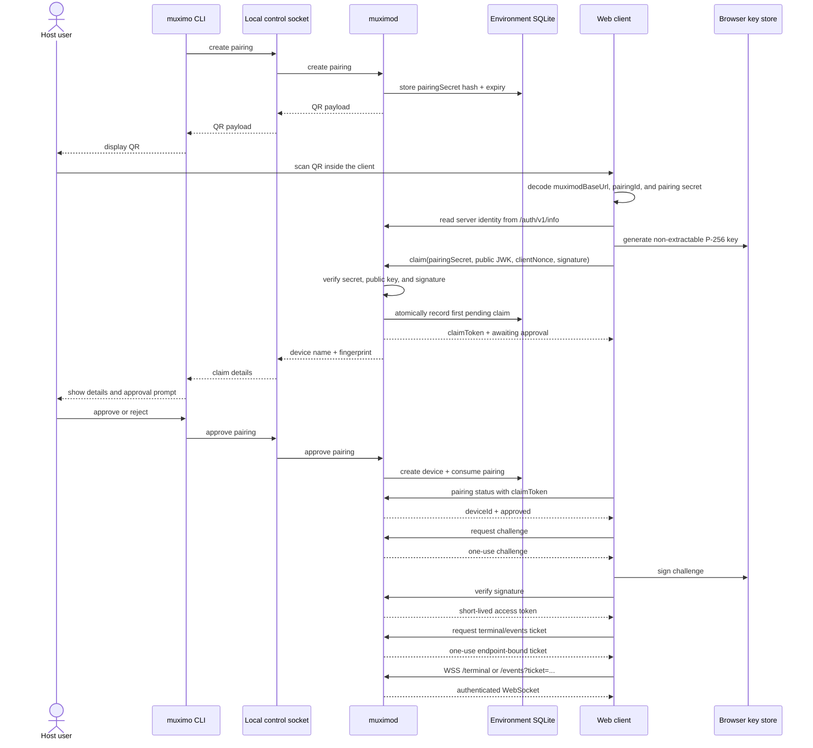

# QR pairing and muximod authentication

Status: pairing code v3 implementation baseline.

Last updated: 2026-08-15

## 1. Goal and scope

`muximod` must not treat network reachability as authorization. Tailscale Serve is the recommended route, but the same application authentication must work through HTTPS reverse proxies, Cloudflare Tunnel, ngrok, same-origin development routes, and a future SSH port-forwarding route.

The first implementation covers:

- QR display from `muximo pair` on the host;
- QR reading and pairing from the web client;
- host-side approval;
- device authentication for HTTP, terminal WebSocket, and events WebSocket;
- persistent pairing across trusted worktree switches;
- persistent device registrations; a revocation administration command is reserved for the next increment.

The first implementation does not cover native key-store integration, SSH route creation, server-key pinning, application-level end-to-end encryption, RBAC, or multiple concurrent `muximod` instances in one environment.

## 2. Threat model and invariants

The OS account running `muximod`, its local tmux server, and its owner-only local control channel are trusted. A network peer, including a peer that is allowed by the Tailscale ACL, is not trusted until device authentication succeeds.

The following are normative invariants:

1. Every operation that can read agent state or cause execution requires an active paired device.
2. `muximod` never receives or persists a device private key.
3. A device private key is generated and retained by the client. The long-lived device credential stored by `muximod` is the device public key.
4. `muximod` may persist hashes of short-lived enrollment and session credentials. These are credential verifiers, not asymmetric private keys, and raw values must not be persisted.
5. `/api/*`, `/terminal`, and `/events` use the same device revocation boundary.
6. Pairing requires both possession of a short-lived QR secret and explicit approval through the host-local control channel.
7. Local, staging, and production are separate authentication realms. They do not share a base authentication database, `serverId`, device keys, or browser key records.
8. A single active `muximod` instance owns an environment in v1. Running two instances against the same environment database is unsupported.
9. Non-loopback browser connections require HTTPS/WSS. `http://localhost` is allowed for local development and SSH-forwarded native routes. Plain remote HTTP is not supported.
10. CORS and `Origin` checks are transport defense-in-depth only; the paired device key is the authorization boundary for every client.

Network access, CORS, and `Origin` checks are defense-in-depth controls. They are not substitutes for device authentication.

## 3. Key model

### 3.1 Device authentication key

The device generates an ECDSA P-256 key pair with SHA-256:

| Value | Owner | Persistence |
| --- | --- | --- |
| Device private key | Web/native client | Browser `CryptoKey` in IndexedDB; native OS key store |
| Device public key | `muximod` | `auth_devices` in the environment database |
| Device fingerprint | Both sides | RFC 7638 JWK thumbprint |

The browser generates the private key as non-extractable. It exports only the public JWK. The private `CryptoKey` is stored in IndexedDB together with `deviceId`, `serverId`, algorithm version, and fingerprint. Access tokens and WebSocket tickets are kept in memory, not in `localStorage`.

The public JWK must contain only the expected P-256 public parameters (`kty`, `crv`, `x`, and `y`). Private parameter `d` and unexpected parameters are rejected. Signatures use the 64-byte IEEE-P1363 form (`r || s`), encoded as unpadded base64url. DER and IEEE-P1363 signatures must not be mixed.

Native clients use the platform key store, preferably with hardware-backed and user-presence protection where available. Native support is a later adapter; it must use the same public-key and signature encoding.

### 3.2 Server identity

There is no `muximod` server private key in v1.

`serverId` is a random, persistent 128-bit identifier for an authentication realm. It is stored in `auth_metadata`, returned by `/auth/v1/info`, and included in signed messages so that a device cannot accidentally use a key from another environment. It is not cryptographic proof that a route terminates at the genuine server.

Server authenticity in v1 comes from HTTPS/Tailscale/SSH route validation. A persistent server identity key and client pinning are added later if an untrusted route or TLS terminator must be defended against independently of transport authentication.

## 4. Environment, Serve, and worktree rules

Each muximod environment has its own endpoint profile:

```text
local: http://127.0.0.1:<muximod-port> or a Tailscale Serve URL
stg:   https://<stg-muximod-host>:<serve-port>
prod:  https://<prod-muximod-host>:<serve-port>
```

The Web UI and muximod are independent services. The Web Serve route exposes only the UI, while the muximod Serve route exposes only the authenticated API and WebSockets:

```text
Web Serve   -> worktree Web port
muximod Serve -> worktree muximod port
```

The client stores the muximod endpoint received from the pairing code. Changing that endpoint normally requires pairing with the new muximod environment again.

The Web connection profile may store `muximodBaseUrl`, `serverId`, display name, and route metadata. It must not store private keys, access tokens, QR secrets, or WebSocket tickets in `localStorage`.

The SQLite database is environment-scoped at its source and worktree-scoped at runtime. Each worktree receives a snapshot copy of the environment database and starts `muximod` with that copy. Give each worktree a distinct `MUXIMOD_INSTANCE_DIR`; its `muximod.sqlite` is the runtime copy. The recommended source layout is:

```text
~/.local/state/muximo/<environment>/muximod.sqlite
```

The existing default path may be treated as the local environment source during migration. It must not be reused by staging or production.

Copying the database is intentional and clones the complete committed environment state, including `serverId`, approved device registrations, unexpired access-session records, pending pairings, and their revocation state. The clone is the same logical environment as of the snapshot, but its state diverges afterward: a revocation or new pairing in one worktree does not appear in another. This is acceptable only for trusted worktrees. A worktree that must be a distinct security principal starts from a new database and is paired separately.

Because the database uses SQLite WAL mode, a worktree must be created from a consistent SQLite snapshot (for example, the existing SQLite snapshot mechanism, SQLite backup, or `VACUUM INTO`). A raw copy of only the main database file while `muximod` is writing is not a valid snapshot. The copy operation must not expose the source database, WAL files, or backups to an untrusted worktree.

If a copied database contains an active access-session hash, a client that still holds the corresponding raw token may use it against the clone until the token expires or is revoked in that clone. This is deliberate snapshot behavior, bounded by the session TTL. Pending pairings and other durable short-lived records follow the same rule. Process-local challenges, WebSocket tickets, live sockets, and terminal PTYs are not database state and are not copied.

Runtime state and authentication state may be split into separate databases later. In v1 they may share one environment database, but only one active `muximod` may own it.

## 5. QR payload and host control

`muximo pair` uses an owner-only local control channel to ask the running `muximod` to create a pairing. The preferred channel is a Unix domain socket with owner-only permissions, for example:

```text
~/.local/state/muximo/<environment>/muximod-control.sock
```

A loopback endpoint with a persistent owner-only control token is an allowed fallback. The control channel must never be exposed through Serve, a tunnel, or a general LAN listener.

The CLI command is conceptually:

```text
muximo pair [--without-serve] [--muximod-base-url URL] [--control-socket PATH]
```

The command creates a pairing valid for five minutes, displays the QR in the foreground, and waits. It does not ask for approval merely because a QR was scanned. After `muximod` receives and validates a complete claim (pairing secret, public key, and proof-of-possession signature), it sends the pending device name and public-key fingerprint to the waiting CLI through the owner-only control channel. The CLI then asks the host user for explicit approval. Empty input, timeout, rejection, or `Ctrl-C` rejects the pairing. A rejected or consumed pairing cannot be reused.

The command is an outer adapter for the `PairDevice` application use case in `packages/application`. The use case depends only on `PairingControlPort` and `PairingPresenterPort`. The CLI's Unix-socket client implements the control port, while the terminal presenter implements the presentation port. `apps/muximo-cli/src/index.ts` is the composition root: it wires the use case and concrete adapters into the command registry. Terminal QR rendering and the `qrcode` package are confined to `@muximo/cli-adapters`; the use case, shared protocol, and `@muximo/muximo-cli` do not depend directly on terminal rendering.

The QR is a raw in-app pairing code. It is decoded by the client scanner and
never navigates the browser. New codes use a compact binary payload so the
endpoint and enrollment secret fit into fewer QR modules:

```text
ma3:<base64url(compact-binary-payload)>
```

The binary payload is `[u16 length + muximodBaseUrl][u16 length + pairingId][pairingSecret]` in UTF-8. The final secret occupies the remaining bytes, avoiding a third length field.

The compact payload contains only the values required before the first claim:

```text
muximodBaseUrl + pairingId + pairingSecret
```

`serverId` is fetched from `/auth/v1/info`, and pairing expiry is enforced by
muximod, so neither is duplicated in the QR. Clients may continue to decode
the previous `ma2:<base64url(canonical-json)>` format during migration, but
the CLI emits only `ma3`.

The QR payload contains no device private key and no long-lived access token. The server stores only `SHA-256(pairingSecret)`. The client must not put the raw pairing code into browser history, navigation, analytics, referrer data, crash reports, or logs.

The QR secret is an enrollment capability, not a complete login credential. Possession of it permits a claim attempt, but does not grant access without host approval. The device public key is not in the QR payload.

## 6. Complete pairing sequence



Only the first valid claim is accepted atomically. If a QR is copied and an attacker claims it first, the legitimate claim is denied and the host sees the attacker's device information and fingerprint. The host rejects the claim and creates a new QR. This is an enrollment denial-of-service, not an authorization bypass. A blind host approval defeats the approval boundary and is not considered safe.

## 7. Authentication protocol

### 7.0 Token model: stateful opaque credentials

v1 does not use JWT, PASETO, or another self-contained/stateless access token. Every credential that grants or bootstraps access is opaque and validated against server-side state. This is required for immediate revocation, one-use WebSocket tickets, and consistent behavior when a SQLite snapshot is copied between trusted worktrees. There is no `muximod` signing private key in v1.

The raw value is held only by the client for as long as necessary. `muximod` stores a SHA-256 hash for durable credentials or keeps a hash in process memory for ephemeral credentials. A token is therefore not self-authenticating: possession of the raw value is useful only while the corresponding state exists, is unexpired, and is not revoked.

| Credential | Raw value held by | Server-side state | Lifetime | Replay rule |
| --- | --- | --- | --- | --- |
| Pairing secret | CLI and browser during pairing | `auth_pairings.secret_hash` in SQLite | 5 minutes | One successful claim; then invalid |
| Pairing claim token | Browser during approval polling | `auth_pairings.claim_token_hash` in SQLite | 10 minutes from claim | Status polling may repeat; never grants API access |
| Device challenge | Browser/native client during sign-in | Process memory, keyed by challenge ID | 60 seconds | One verification attempt; consumed on success or failed verification |
| HTTP access token | Browser/native client memory | `auth_sessions.token_hash` in SQLite | 15 minutes | Reusable until expiry/revocation |
| WebSocket ticket | Client memory, then URL for one upgrade | Process memory, keyed by ticket hash | 30 seconds | One successful upgrade; consumed before upgrade |
| Terminal resume token | Client terminal state | Process memory in the live PTY session | 30 seconds while parked | Rotate after successful resume; never authenticates a new socket |

This split is intentional. Durable device registrations and HTTP sessions are copied with SQLite. Challenges, tickets, sockets, and PTYs are live process state and naturally disappear on daemon restart; they are not an auth-specific shared-database exception.

### 7.1 Pairing claim

The web client calls:

```text
POST /auth/v1/pairings/{pairingId}/claim
```

The body contains:

```json
{
  "pairingSecret": "...",
  "publicKey": { "kty": "EC", "crv": "P-256", "x": "...", "y": "..." },
  "deviceName": "iPhone",
  "deviceType": "browser",
  "clientNonce": "...",
  "signature": "..."
}
```

The signature covers the UTF-8 encoding of the following fields, in order, with one trailing newline. Fields use a restricted grammar and cannot contain newlines:

```text
MA-PAIR-CLAIM-V1
<serverId>
<pairingId>
<base64url(SHA-256(pairingSecret))>
<public-key-thumbprint>
<clientNonce>
```

The browser generates the P-256 key pair locally after reading the QR. It retains the private key in its key store, exports the public JWK, and sends that public JWK in this claim request. `muximod` verifies the secret hash, server realm, public-key format, and proof-of-possession signature before recording the pending claim. It then creates a random claim token, stores only its hash in the pairing row, and returns the raw claim token once. The pending public key is not yet an `auth_devices` registration and cannot create a session or call `/api`. The claim token is a status-polling capability only.

The browser polls:

```text
GET /auth/v1/pairings/{pairingId}
Authorization: Pairing <claimToken>
```

The status endpoint returns only `offered`, `awaiting_approval`, `approved`, `rejected`, or `expired`, plus `deviceId` after approval. The claim token is valid only until the ten-minute claim deadline and never returns an access token before approval. After approval, repeated polling may return the same `deviceId` until the claim record expires; it still cannot be used for any other operation.

When the host approves through the local control channel, `muximod` performs one transaction that creates the active `auth_devices` row from the pending public key and marks the pairing consumed. Only after this transaction does the browser proceed to device challenge and session creation. A rejection marks the pending claim rejected and discards the pending registration; the browser must generate a new key and use a new QR.

### 7.2 Device session

The client requests a one-use challenge:

```text
POST /auth/v1/challenges
{ "deviceId": "..." }
```

The request is rate-limited. `muximod` verifies that the device exists and is active, then stores the challenge nonce only in process memory. The challenge expires after 60 seconds and is consumed on the first verification attempt, including an invalid signature. A daemon restart invalidates outstanding challenges.

The client signs:

```text
MA-SESSION-V1
<serverId>
<deviceId>
<challengeId>
<base64url(challengeNonce)>
<expiresAt ISO-8601 timestamp>
```

The client sends the signature to:

```text
POST /auth/v1/sessions
{ "deviceId": "...", "challengeId": "...", "signature": "..." }
```

On success, `muximod` atomically consumes the challenge, creates an `auth_sessions` row, and returns a random 256-bit opaque access token and session metadata. The token is stored only in client memory; `muximod` stores only its hash. The session is bound to `serverId` and `deviceId`, but not to route, hostname, IP address, or User-Agent. The client repeats challenge-response near expiry and replaces the token. No refresh token is used in v1.

An access token is reusable for ordinary HTTP requests until its 15-minute expiry. The service-level device revocation path marks the device revoked, revokes all its sessions, and closes its live WebSockets; the user-facing administration command is a follow-up increment.

Operational HTTP routes use:

```http
Authorization: Bearer <access-token>
```

### 7.3 WebSocket authentication

Browsers cannot set an arbitrary `Authorization` header in the WebSocket constructor. The client first calls the authenticated HTTP endpoint:

```text
POST /auth/v1/ws-tickets
{ "endpoint": "terminal" }
```

or:

```text
POST /auth/v1/ws-tickets
{ "endpoint": "events" }
```

The ticket is a random 256-bit value. `muximod` stores only its hash in process memory, with a record containing the issuing `authSessionId`, `deviceId`, exact endpoint, issue time, and 30-second expiry. It is consumed atomically before the upgrade is completed. The ticket is bound to the current device/session and exact endpoint:

```text
wss://host/terminal?ticket=<ticket>
wss://host/events?ticket=<ticket>
```

Access tokens must never be placed in a WebSocket URL. Reverse proxies and application logs must redact the `ticket` query parameter. If two upgrade attempts race with the same ticket, exactly one may succeed.

After the ticket is consumed, the socket is bound to `authSessionId` and `deviceId`; no bearer token is required on individual frames. The socket is closed when its auth session expires, immediately when the session or device is revoked, or on daemon shutdown. The client signs a new challenge, obtains a new access token and ticket, and reconnects. For terminal sockets, the existing parked PTY may be resumed with its separate device-bound `resumeToken` within 30 seconds.

The existing terminal `sessionId` and `resumeToken` remain PTY-resume credentials, not device authentication. A terminal session records its owning `deviceId`; a different device cannot resume it with a stolen resume token. The resume token is process-local, expires after the existing 30-second parked grace period, is invalidated on detach/PTY exit/restart/revocation, and is rotated after a successful resume. It cannot be used to bypass the WebSocket ticket.

## 8. Route and endpoint policy

| Endpoint | Authentication | Policy |
| --- | --- | --- |
| `GET /health` | None | Minimal liveness only |
| `GET /auth/v1/info` | None | Protocol version, `serverId`, server time |
| `POST /auth/v1/pairings/*/claim` | Pairing secret + proof of possession | Short-lived, first claim only |
| `GET /auth/v1/pairings/*` | Pairing claim token | Status only |
| `POST /auth/v1/challenges` | None | Public challenge issuance; rate-limit; active device required |
| `POST /auth/v1/sessions` | Device signature | Creates session |
| `POST /auth/v1/ws-tickets` | Bearer session | Endpoint-bound one-use ticket |
| `/api/*` | Bearer session | Required for every operation |
| `/terminal` | One-use WebSocket ticket | Required before upgrade |
| `/events` | One-use WebSocket ticket | Required before upgrade |
| `/internal/tmux-hook` | Existing hook token + local-only exposure | Never expose through Serve/tunnels |
| Host pairing/device administration | Owner-only local control channel | CLI approval and revocation |

Unauthenticated auth endpoints must be rate-limited. CORS must use an exact per-environment allowlist instead of the current wildcard default. If an HTTP or WebSocket request has an `Origin`, it must match the allowlist exactly; requests without `Origin` remain valid for CLI/native clients. These checks do not replace device authentication.

Authentication uses headers rather than cookies in v1, so conventional cookie CSRF is not the primary threat. XSS on the stable web origin remains a critical threat and requires a strict CSP, no unnecessary third-party scripts, and no credential material in telemetry.

## 9. Persistence model

The existing environment SQLite database may contain the following additional logical tables:

| Table | Required fields | Sensitive values |
| --- | --- | --- |
| `auth_metadata` | singleton `server_id`, schema/protocol version, created time | No |
| `auth_devices` | `device_id`, public JWK, thumbprint, name/type, status, approval/last-seen/revocation times | Public key only |
| `auth_pairings` | pairing ID, secret hash, claim-token hash, expiry, state, pending public key/fingerprint/metadata, claim/approval times | Secret and claim-token hashes |
| `auth_sessions` | session ID, device ID, access-token hash, issued/expiry/revocation times | Token hash |
| `audit_events` | event type, device/pair/session IDs, sanitized metadata, timestamp | Must not contain raw secrets |

Device challenges and WebSocket tickets are bounded in-memory state in v1. A daemon restart invalidates them. Pairing records, device records, and access-session records persist across restart and are included in a trusted worktree database snapshot.

The following values must never be written to SQLite, audit logs, request logs, QR diagnostics, or telemetry:

- device private keys;
- raw pairing secrets;
- raw access tokens;
- raw WebSocket tickets;
- terminal resume tokens;
- signatures or full URLs containing any of the above;
- terminal data.

## 10. Device lifecycle

- A device is created only after an approved pairing.
- A device has `active` or `revoked` status. v1 grants the same full control scope to every active device; RBAC is deferred.
- Local CLI administration provides device listing and revocation. Remote device administration is deferred.
- Revocation invalidates all sessions, drops pending challenges and tickets for the device, and closes associated terminal and events WebSockets.
- A browser profile reset, IndexedDB deletion, lost native key, or key corruption requires a new pairing.
- Key rotation, recovery/export, and device-to-device transfer are deferred. Private-key export is not part of the normal browser flow.
- Logout revokes the current session; it does not remove the device registration.

## 11. Explicitly deferred decisions

- Native Keychain/Keystore/Secure Enclave adapters.
- SSH port-forwarding route creation.
- Persistent `muximod` server identity key and client pinning.
- Application-level E2E encryption or HPKE/libsodium transport wrapping.
- RBAC and per-device scopes.
- Remote approval UI.
- Multiple concurrent `muximod` instances sharing one environment.
- Key recovery, rotation, and device transfer.
- Separate `auth.sqlite` and runtime database.

## 12. Validation gates before implementation is considered complete

1. Browser, Bun, and a native reference implementation agree on P-256 JWK thumbprints and IEEE-P1363 signatures.
2. Duplicate QR claims, duplicate approvals, challenge replay, session replay, and simultaneous WebSocket ticket use are rejected atomically.
3. Missing, expired, revoked, wrong-endpoint, and wrong-environment credentials are rejected for every `/api`, `/terminal`, and `/events` route.
4. Revocation closes both WebSocket types and prevents terminal resume by another device.
5. Pairing expiry, approval timeout, rejection, daemon restart, and clock skew are covered.
6. Exact CORS/`Origin` behavior is tested for hostile browser origins and origin-less CLI/native requests.
7. Tailscale Serve and a generic HTTPS reverse proxy preserve pairing, session, and WebSocket behavior; ticket query parameters are redacted from logs.
8. Switching the Serve target between trusted worktrees retains the browser key and copied device/session state without QR re-pairing, while revocation and pairing changes are proven to diverge per clone.
9. Local/staging/production authentication cannot cross each other, even when one environment's QR or endpoint is copied.
10. Browser secure-context, IndexedDB persistence, non-exportability, CSP, and telemetry checks pass.
11. Database snapshots taken during WAL activity are consistent, and database/local-control-socket permissions are owner-only.
